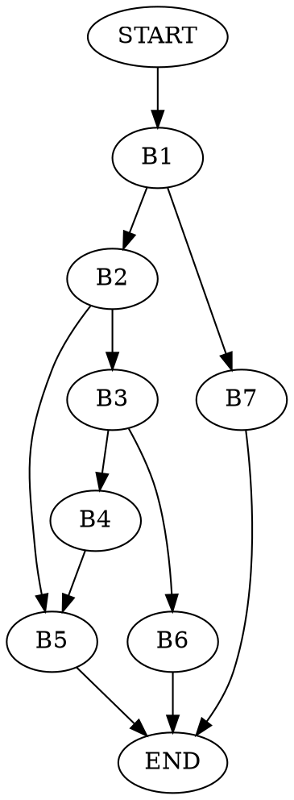

# ASK Lista 5 - Wojciech Adamiec
## Zadania Deklarowane: 1, 4, 5

### Zadanie 1.
:::info

:::


Funkcja ta zwraca liczbę zaplonych bitów
```=
puzzle: testl %esi, %esi    # AND na %esi esi==0 -> ZF set
        je .L4              # if n == 0 goto L4
        xorl %edx, %edx     # edx = 0 # our counter: i
        xorl %eax, %eax     # eax = 0 # our res
.L3:    movl %edi, %ecx     # ecx = x # our aux
        andl $1, %ecx       # aux = aux & 1
        addl %ecx, %eax     # res += aux
        sarq %rdi           # x >> 1
        incl %edx           # i += 1
        cmpl %edx, %esi     # if (i != n)
        jne .L3             # goto L3
        ret                 # return res
.L4:    movl %esi, %eax     # return 0
        ret                 
```
```c=
int puzzle(long x, unsigned n) {
    if (n == 0) 
        return 0;

    int res = 0;
    for(unsigned i = 0; i != n; ++i) {
      res += 1 & x;
      x = x >> 1;
    }
      
    return res;
}
```

### Zadanie 2.
:::info

:::

### Zadanie 3.
:::info

:::

### Zadanie 4.
:::info

:::


```=
puzzle4:
        movq %rcx, %rax          | rax = e                 #B1
        subq %rdx, %rax          | rax = e - s
        shrq %rax                | rax = (e - s) / 2
        addq %rdx, %rax          | rax = s + (s - s) / 2
        cmpq %rdx, %rcx          | if (e < s)
        jb .L5                   | goto L5
        movq (%rdi,%rax,8), %r8  | aux = a[pos]            #B2
        cmpq %rsi, %r8           | if (aux == v)  
        je .L10                  | goto L10
        cmpq %rsi, %r8           | if (aux > v)            #B3
        jg .L11                  | goto L11
        leaq 1(%rax), %rdx       | else: s = pos + 1       #B4
        call puzzle4             | puzzle(a, v, s, e)
.L10:   ret                      | return                  #B5
.L11:   leaq -1(%rax), %rcx      | s = pos - 1             #B6
        call puzzle4             | puzzle(a, v, s, e)
        ret                      | return
.L5:    movl $-1, %eax           | rax = -1                #B7
        ret                      | return -1
```
```c=
*a = rdi, v = rsi, s = rdx, e = rcx
aux = r8

int puzzle4(long *a, long v, uint64_t s, uint64_t e)
{
    uint64_t pos = s + (e - s) / 2;
    if(e < s) 
        return -1;
    long aux = a[pos];
    if(aux == v) 
        return pos;
    if(aux > v) 
        e = pos-1;
    else 
        s = pos+1;
    return 
        puzzle4(a, v, s, e);
}
```

Ta funkcja to *binary search*.

Graf przepływu:


### Zadanie 5.
:::info

:::

Kod w C
```c=
long switch_prob(long x, long n)
{
    switch(n)
    {
        case 60:                // L_0
        case 61:
            return x * 8;
        case 64:                // L_3
            return x >> 3;
        case 62:                // L_1
            x *= 15;
        case 65:                // L_4
            x *= x;             
        default:                // L_2
            return x + 75;      
    }
}
```