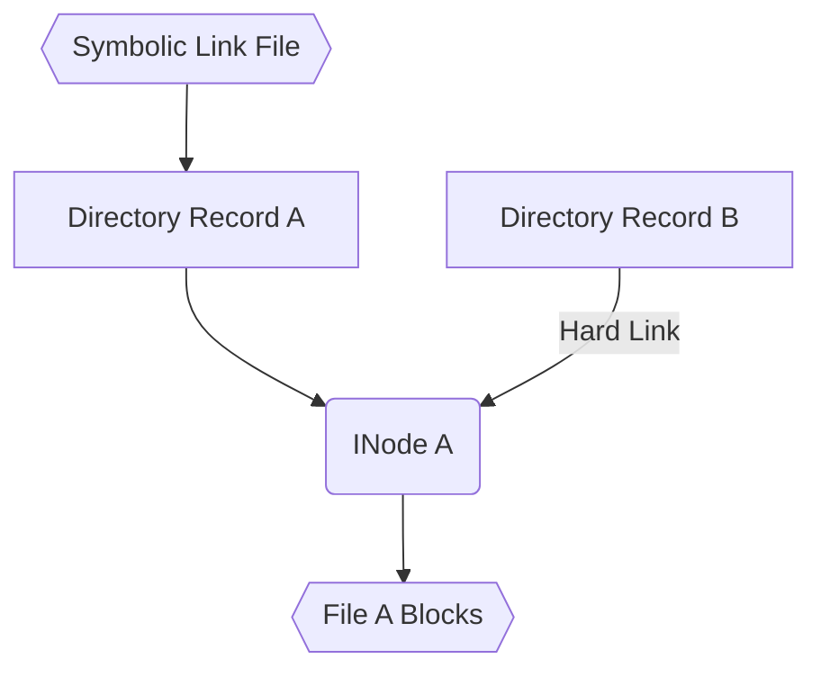

# Systemy Operacyjne - Lista 11

## Wojciech Adamiec, 310064

### Deklarowane zadania: 1, 2, 3, 4, 5, 6

### Zadanie 1.
:::info

:::

Punkty montażowe to specjalne pliki, które stanowią korzenie systemów plików.

`sudo lsblk`
`sudo df -aTh`

* MAJ:MIN - typ:partycje urządzenia
* RM: - removable device
* RO: - read only

Pseudosystemy plików:

* /sys
* /proc
* /dev

A pseudo file system maintains information about the currently running system. This information doesn't persist across reboots. It exists while the system in running only in RAM.

For example, /proc on many OSes is a procfs which dynamically generates directories for every process. Similarly, /sys on Linux generates files and directories to represent hardware layouts.

* noatime - Do not update inode access times on this filesystem (e.g. for
           faster access on the news spool to speed up news servers). Przyspieszenie wydajności
           
* noexec - Do not permit direct execution of any binaries on the mounted
           filesystem. Ze względów bezpieczeństwa
* sync - All I/O to the filesystem should be done synchronously. In
           the case of media with a limited number of write cycles (e.g.
           some flash drives), sync may cause life-cycle shortening. Jak chcemy, wyłączyć buforowanie ze względów bezpieczeństwa


### Zadanie 2.
:::info

:::

W systemie `ext2` partycje, dyski, pliki i urządzenia blokowe są podzielone na sektory nazywane **blokami**.

Bloki łączą się w **grupy bloków**, które istnieją w celach optymalizacji wydajności oraz zmniejszenia fragmentacji.

**Superblok** to blok przechowujący metadane o systemie plików. Główna kopia superbloku jest przechowywana na offsecie 1024 bajtów od początku urządzenia. Kopie zapasowe można sprawdzić wywołując polecenie `sudo dumpe2fs /dev/sda5 | grep -i superblock`:

Deskryptory grup (GDs) przechowują położenie
i rozmiar bitmapy zajętości bloków i i-węzłów każdej grupy bloków

**Tablica deskryptorów grup bloków** to tablica definująca parametry wszystkich grup bloków. Przechowywana jest w pierwszym bloku po superbloku. Ich kopie są przechowywane z każdą kopią superbloku.

`sudo debugfs` -> `open /dev/sda5` -> `show_super_stats`


Liczba wpisów tablicy deskryptorów grup bloków: s_blocks_count / s_blocks_per_group


Inode table size = s_inodes_per_group / inodes_per_block, gdzie inodes_per_block = block_size / s_inode_size

`sudo dumpe2fs /dev/sda5 | grep -C 1000 superblock`

Grupy bloków 0, 1 oraz grupy powstałe z potęg liczb 3, 5 i 7 przechowują kopię zapasową superbloku i tablicy deskryptorów grup bloków.

### Zadanie 3.
:::info

:::

**Blok pośredni** (ang. indirect block) to blok zawierający wskaźniki na inne bloki pośrednie lub na bloki danych, zwykle jest używany przy pracy z dużymi plikami.

**Zapis synchroniczny** wykonywany jest za pomocą polecenia $fsync(2)$ lub $fdatasync(2)$. Dane zapisywane są w taki sposób, że po crashu systemu lub reboocie pliki nadal mogą zostać odzyskane.

**Spójność systemu plików** to zgodność metadanych z faktycznym stanem struktur w systemie plików.

Dopisanie $n$ bloków na koniec pliku może odbywać się w następujący sposób:
- Oznaczamy je jako używane w bitmapie
- Wybieramy wolne bloki i zapisujemy do nich nowe dane
- Dodajemy bloki do i-węzła: 
    - W razie potrzeby tworzymy bloki pośrednie lub modyfikujemy aktualnie istniejące
    - Aktualizujemy metadane i-węzła: wskaźniki na bloki, rozmiar i timestamp


### Zadanie 4.
:::info

:::

**Atomowość** polega na wykonaniu operacji w pełni, albo w ogóle. Oznacza to, że plik zostanie przeniesiony w całości, albo wcale, nie może się wydarzyć nic “pomiędzy”. Sprawia to, że wykonywanie różnych akcji jest bezpieczniejsze, jako że mamy pewność, że nie zostanie wykonany jakiś ułamek całości.

`man 3 rename`

```c=
int rename(const char *old, const char *new);
```

```
EXDEV
    The links named by new and old are on different file systems 
    and the implementation does not support links between file systems.
```

$rename(2)$ nie umożliwia przenoszenia pliku pomiędzy różnymi systemami plików, ponieważ zmienia on jedynie wpisy w katalogach. Każdy system plików ma własną tablicę i-węzłów, więc nr węzła, który wpiszemy do katalogu będzie nieprawidłowy lub będzie wskazywać na niewłaściwy węzeł.

Przy przenoszeniu pliku mogą wystąpić dwa scenariusze:
- *newpath* odnosi się do istniejącego już wpisu w danym katalogu. W takim wypadku należy zmienić nr i-węzła w rekordzie katalogu.
- *newpath* odnosi się do nieistniejącego wpisu. W takim wypadku należy dodać odpowiedni wpis do katalogu.

Dopiero po dodaniu nowego wpisu, stary jest usuwany.

### Zadanie 5.
:::info

:::


Kroki przy usuwaniu pliku:
 - Usunięcie wpisu z katalogu
 - Ustawienie licznika dowiązań `i_links_count` na `i_links_count - 1`
     - Jeśli licznik wynosi 0, to zwalniamy i-węzeł oraz jego bloki

Możliwe problemy przy awariach:
- Jeśli awaria nastąpi bezpośrednio po usunięciu wpisu z katalogu, to będziemy mieli zajęty i-węzeł, który nigdy nie zostanie zwolniony.
- Jeśli uda nam się zmniejszyć licznik, to wtedy zwolnienie będzie już możliwe (ale niekoniecznie się wykona).
- Jeśli awaria nastąpi przed zwolnieniem bloków, to zostaniemy z blokami, których nie da się zwolnić.

Aby odkasować plik, musimy mieć pewność, że jego bloki nie zostały nadpisane - w przeciwnym przypadku odkasowanie będzie niemożliwe. Kolejnym warunkiem jest to, że i-węzeł nie mógł zostać nadpisany.

Pliki zostają całkowicie skasowane w momencie, gdy ich dane zostaną nadpisane innymi plikami lub gdy wszystkie deskryptory plików wskazujące na ten plik zostaną usunięte.

### Zadanie 6.
:::info

:::

**Dowiązanie twarde** (ang. hard link) to wskaźnik na i-węzeł pliku, który wlicza się do licznika referencji do pliku. W i-węźle zwiększany jest licznik dowiązań i_links_count, a w katalogu tworzone jest mapowanie name - inode.

**Dowiązanie symboliczne** (ang. symbolic link) to dowiązanie kodujące ścieżkę, do której należy przekierować algorytm rozwiązywania nazw. Dla wszystkich dowiązań symbolicznych krótszych niż 60 bajtów dane są przechowywane w i-węźle pliku reprezentującego dowiązanie.



Aby stworzyć pętlę, w dowolnym katalogu możemy stworzyć dowiązanie symboliczne (flaga -s) do tego samego katalogu, lub do jednego z jego rodziców.

Przykład:

```
$ ln -s . link
$ cd link
/link$ cd link
/link/link$ cd link
.
.
.
/link/link/.../link$ cd link
```

In order to protect the kernel against stack overflow, and also to protect against denial of service, there are limits on the maximum recursion depth, and on the maximum number of symbolic links followed.  An ELOOP error is returned when the maximum is exceeded ("Too many levels of symbolic links").

**Pętla z dowiązaniem twardym**
Nie jest możliwe utworzenie takiej pętli ponieważ nie da się zrobić dowiązania twardego do katalogu.

**Dlaczego?**
Zaburzyło by to strukturę systemu plików, która jest skierowanym grafem acyklicznym.
Rozróżnienie katalogu od dowiązania twardego było by niemożliwe, przez co trudniej było by zapobiegać pętlom.


### Zadanie 7.
:::info

:::

### Zadanie 8.
:::info

:::

### Zadanie 9.
:::info

:::

### Zadanie 10.
:::info

:::
